<div align="center">


# 🏥 MediGuide AI

### *Your Intelligent Healthcare Companion*

**AI-powered • Multilingual • Voice-enabled • Doctor-connected • Emergency-ready**

<p>
  <strong>
    Empowering accessible healthcare guidance through AI, voice technology,
    digital consultations and multilingual support.
  </strong>
</p>

<br/>

<a href="#-getting-started">

</a>
<a href="#-features">

</a>
<a href="#-architecture">

</a>
<a href="#-contributing">

</a>

<br/><br/>


<br/>


</div>

---

<div align="center">


</div>

---

# 🌟 What is MediGuide AI?

**MediGuide AI** is a multilingual healthcare platform designed to make healthcare guidance more accessible, interactive and convenient.

Instead of providing only a traditional appointment experience, the platform brings multiple healthcare capabilities together in one application:

> 🤖 **AI Healthcare Guidance**
> 🔍 **Symptom Assessment**
> 🎤 **Voice & Emotion Analysis**
> 🌍 **13 Indian Languages**
> 👨‍⚕️ **Doctor Consultations**
> 🎥 **Real-Time Video Calls**
> 💊 **Digital Prescriptions**
> 🚑 **Emergency Assistance**
> 💳 **Digital Payment Support**

The platform combines a modern React interface with Firebase services, browser-based voice analysis, video consultation technology and document-generation capabilities.

---

# 💡 Why MediGuide AI?

<div align="center">

| 🏥 Challenge                                    | 💡 MediGuide Approach                        |
| ----------------------------------------------- | -------------------------------------------- |
| Limited access to immediate healthcare guidance | 🤖 AI-powered healthcare assistant           |
| Language barriers                               | 🌍 Support for 13 Indian languages           |
| Difficulty describing symptoms                  | 🎤 Text + voice + image input                |
| Lack of quick triage support                    | 🚨 Urgency classification                    |
| Doctor availability issues                      | 🎥 Online video consultation                 |
| Paper-based prescriptions                       | 💊 Digital PDF prescriptions                 |
| Prescription authenticity concerns              | 🔐 QR-based verification                     |
| Emergency response delays                       | 🚑 Ambulance assistance                      |
| Fragmented healthcare experience                | 🧩 Multiple healthcare tools in one platform |

</div>

---

# ✨ Key Highlights

<div align="center">

|       | Capability                  | Highlights                                |
| ----- | --------------------------- | ----------------------------------------- |
| 🤖    | **AI Healthcare Assistant** | Medical conversations and health guidance |
| 🔍    | **Smart Symptom Checker**   | Text, voice and image-based input         |
| 🎤    | **Voice Emotion AI**        | Voice pattern and urgency analysis        |
| 🌍    | **Multilingual Healthcare** | 13 Indian languages                       |
| 👨‍⚕️ | **Doctor Dashboard**        | Appointments, patients and prescriptions  |
| 🎥    | **Video Consultation**      | Real-time doctor-patient calls            |
| 💊    | **Digital Prescription**    | PDF + QR verification                     |
| 🚑    | **Emergency System**        | Ambulance request and tracking            |
| 💳    | **UPI Payments**            | QR-based payment experience               |
| 💬    | **Real-Time Chat**          | Doctor-patient communication              |
| 🔐    | **Role-Based Access**       | Patient, Doctor and Admin experiences     |
| 📊    | **Analytics**               | Health and consultation insights          |

</div>

---

# 🚀 Features

## 🤖 1. AI-Powered Medical Chatbot

MediGuide AI provides an interactive healthcare assistant capable of understanding natural-language conversations.

### What it provides

* 🧠 Intelligent conversational interaction
* 🏥 Support for 46+ medical categories
* 💭 Context-aware conversations
* 🚨 Emergency symptom identification
* 📊 Personalized health insights
* 🌍 Multilingual interaction

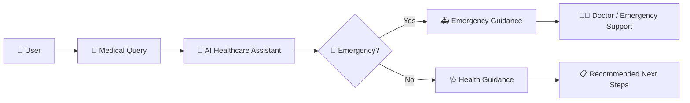

---

# 🔍 2. Advanced Symptom Checker

The symptom checker supports multiple ways of communicating health concerns.

### 📥 Input Methods

| Input             | Technology      | Purpose                       |
| ----------------- | --------------- | ----------------------------- |
| ⌨️ Text           | Text processing | Describe symptoms             |
| 🎤 Voice          | Web Speech API  | Speak naturally               |
| 📸 Image          | File/Image API  | Upload visual information     |
| 🎵 Voice Analysis | Meyda           | Analyze voice characteristics |

### 🧠 Assessment Capabilities

* 🎯 Urgency detection
* 🚨 Critical symptom detection
* 🎭 Emotion classification
* 🔍 Medical keyword recognition
* 📊 Voice quality analysis
* ⚡ Instant health insights

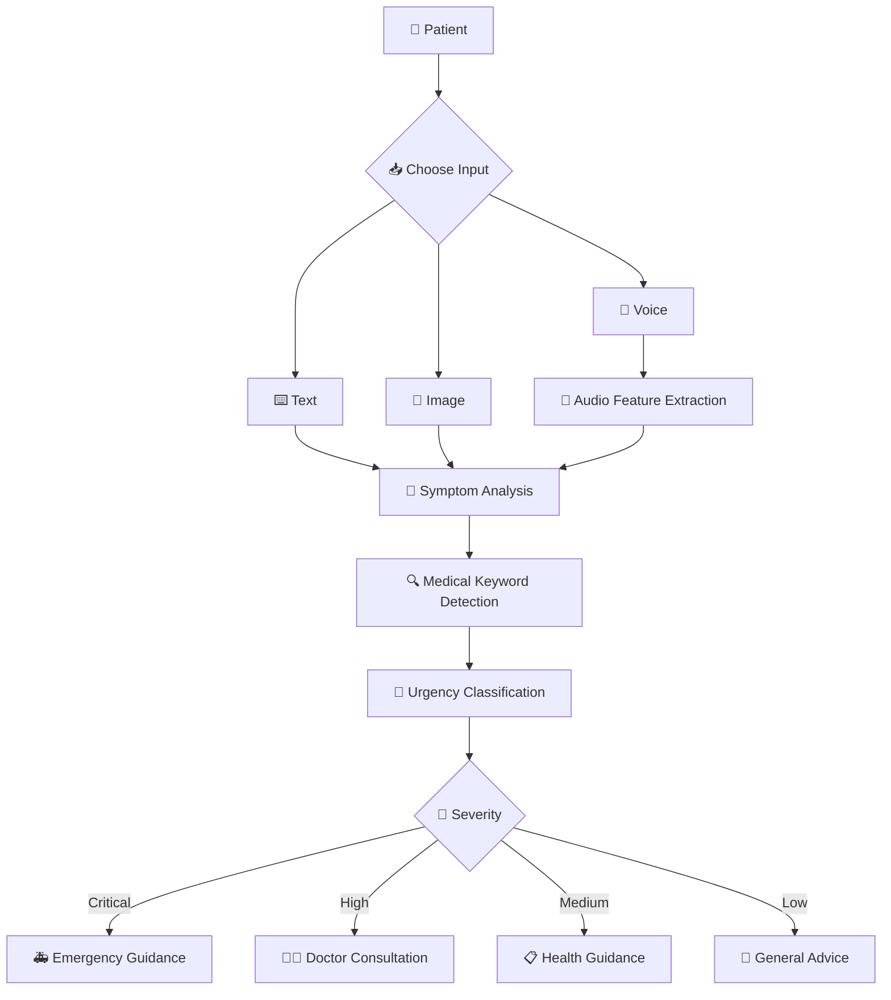

> ⚠️ MediGuide AI is intended to provide healthcare assistance and educational guidance. It is not a replacement for a qualified medical professional.

---

# 🎤 3. Voice Emotion & Urgency AI

One of the distinctive capabilities of MediGuide AI is its browser-based voice analysis system.

The system analyzes audio characteristics to identify patterns that may indicate distress, pain, anxiety or weakness.

## 🎵 Audio Features

Meyda is used for audio feature extraction including:

* 🔊 RMS / Volume
* 📈 Energy
* 🔄 Zero-Crossing Rate
* 📊 Peak Analysis
* 📉 Variance
* 🎚️ Dynamic Range
* 🗣️ Speech Rate
* 🌊 Spectral Flux

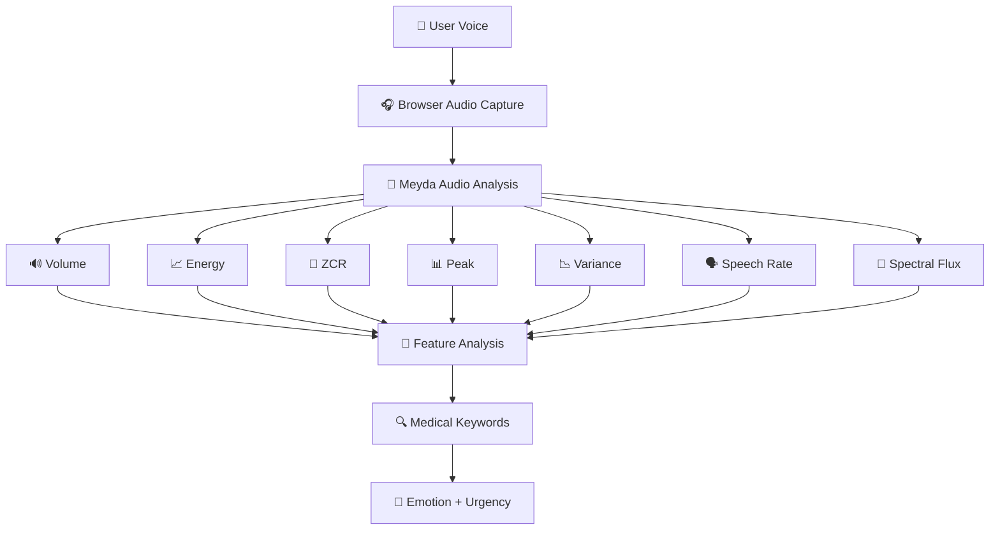

### 🎭 Classification Model

| Emotion         | Typical Indicators                  | Urgency  |
| --------------- | ----------------------------------- | -------- |
| 🟢 Calm         | Stable tone and normal patterns     | Low      |
| 🟡 Weak / Tired | Low volume and weakness indicators  | Medium   |
| 🟡 Anxious      | Fast speech and elevated pitch      | Medium   |
| 🟠 Distressed   | Unstable voice and fast speech      | High     |
| 🟠 In Pain      | Voice strain and pain indicators    | High     |
| 🔴 Critical     | Critical keywords + severe distress | Critical |

### 🔒 Privacy

Voice analysis is designed around client-side processing:

* 🔐 Audio is analyzed in real time
* 🚫 Audio is not intentionally stored
* 💻 Processing occurs in the browser
* ☁️ Audio is not uploaded to a cloud service for this feature
* 🎙️ Microphone access requires explicit permission

---

# 🌍 4. Multilingual Healthcare

MediGuide AI supports **13 Indian languages** with native-script support.

<div align="center">

| 🇮🇳 Language  | Native Script | Code |
| -------------- | ------------- | ---- |
| 🇬🇧 English   | English       | `en` |
| 🇮🇳 Hindi     | हिंदी         | `hi` |
| 🇮🇳 Tamil     | தமிழ்         | `ta` |
| 🇮🇳 Telugu    | తెలుగు        | `te` |
| 🇮🇳 Bengali   | বাংলা         | `bn` |
| 🇮🇳 Marathi   | मराठी         | `mr` |
| 🇮🇳 Gujarati  | ગુજરાતી       | `gu` |
| 🇮🇳 Kannada   | ಕನ್ನಡ         | `kn` |
| 🇮🇳 Malayalam | മലയാളം        | `ml` |
| 🇮🇳 Punjabi   | ਪੰਜਾਬੀ        | `pa` |
| 🇮🇳 Odia      | ଓଡ଼ିଆ         | `or` |
| 🇮🇳 Assamese  | অসমীয়া       | `as` |
| 🇮🇳 Urdu      | اردو          | `ur` |

</div>

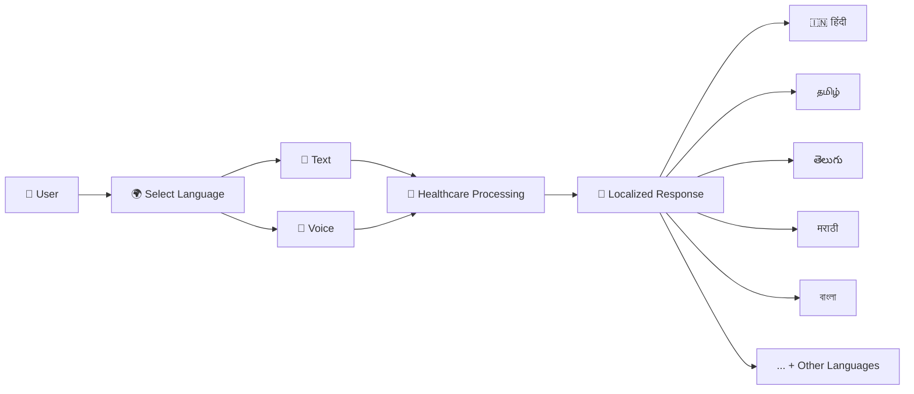

---

# 🎥 5. Real-Time Video Consultation

MediGuide AI integrates **Whereby** for doctor-patient video consultations.

### Features

* 📹 HD video consultation
* 🔒 Appointment-based rooms
* ⏱️ Call duration tracking
* 💬 In-call messaging
* 📱 Responsive experience
* 📊 Consultation history
* 🎙️ Audio/video controls

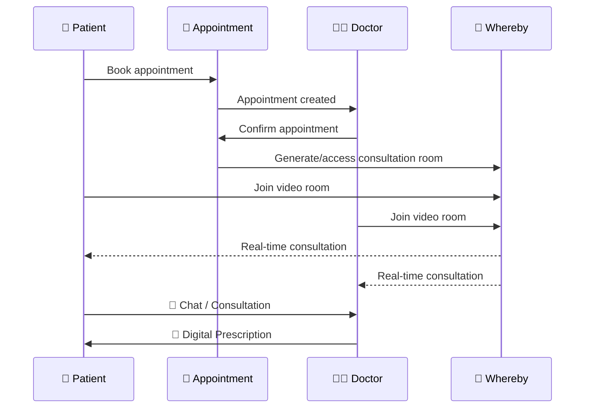

---

# 💊 6. Digital Prescription System

Doctors can generate digital prescriptions after consultations.

### Prescription capabilities

* 📝 Professional prescription format
* 📄 PDF generation
* 🔐 QR verification
* 🆔 Unique prescription IDs
* ✍️ Digital doctor authentication
* 🔍 Public verification

### Prescription Flow

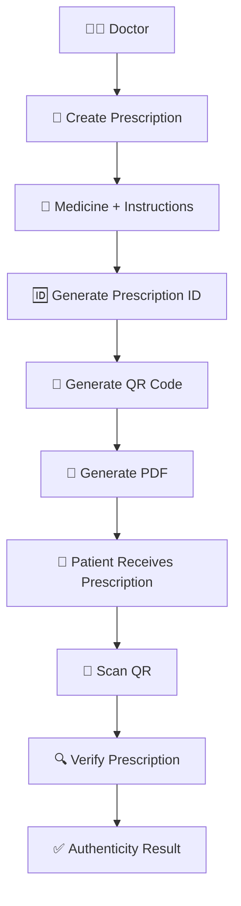

Example prescription ID:

```text
RX-YYYY-NNNNNN
```

---

# 🚑 7. Emergency Ambulance System

The emergency module provides a dedicated workflow for requesting and managing ambulance assistance.

### Capabilities

* 📍 Real-time GPS tracking
* 🗺️ Route optimization
* ⚡ One-tap emergency request
* 📊 Ambulance mission dashboard
* 💰 Mission earnings tracking
* 🔔 Audio notifications

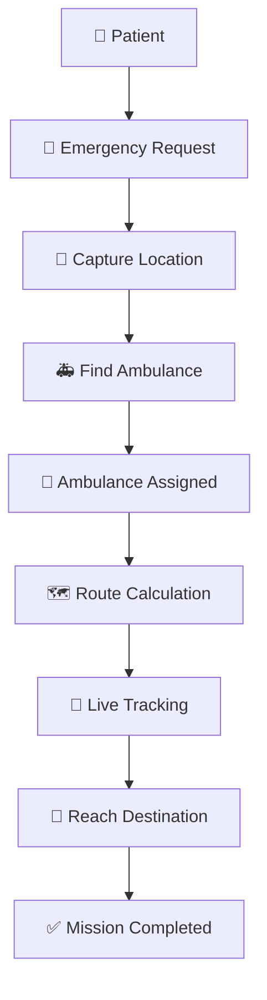

---

# 👨‍⚕️ 8. Doctor Dashboard

The doctor dashboard brings consultation-related activities into one workspace.

### Doctor capabilities

* 📅 Appointment management
* 👤 Patient information
* 💬 Patient communication
* 📝 Digital prescriptions
* 📊 Analytics
* 🎥 Video consultations
* 📱 Profile management
* 📄 Medical reports

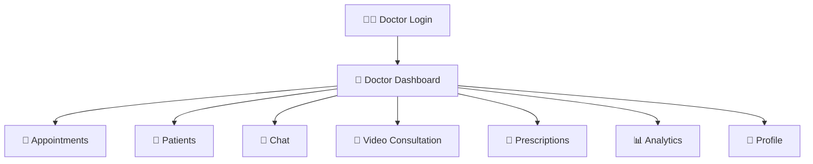

---

# 💳 9. UPI Payment Experience

The platform includes a QR-based payment interface supporting popular Indian UPI applications.

### Supported experience

* 📱 GPay
* 📱 PhonePe
* 📱 Paytm
* 📱 BHIM
* 🔳 QR code generation
* ✨ Animated scanning UI
* ✅ Payment verification
* 📊 Payment history

---

# 🔐 10. Role-Based Experience

MediGuide AI provides different experiences based on the user's role.

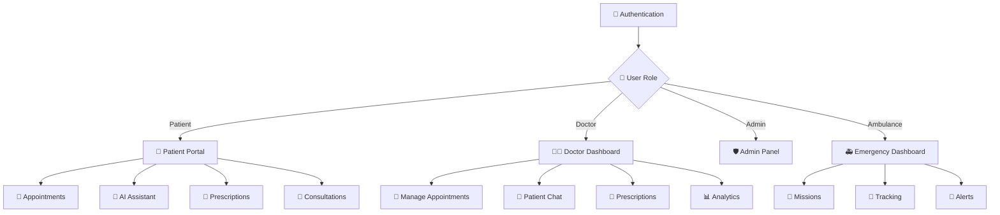

---

# 🛠️ Technology Stack

## 🎨 Frontend

| Technology                 | Purpose                            |
| -------------------------- | ---------------------------------- |
| ⚛️ React 18.3.1            | Component-based UI                 |
| 📘 TypeScript 5.6.3        | Type safety                        |
| ⚡ Vite 6.0.1               | Development and production tooling |
| 🧭 React Router DOM 6.28.0 | Client-side routing                |
| 🎨 CSS Modules             | Component-scoped styling           |

## 🔥 Backend & Data

| Technology                 | Purpose                  |
| -------------------------- | ------------------------ |
| 🔥 Firebase 12.9.0         | Backend-as-a-Service     |
| 🔐 Firebase Authentication | User authentication      |
| 🗄️ Firestore              | NoSQL data storage       |
| ⚙️ Cloud Functions         | Serverless backend logic |
| 🌐 Firebase Hosting        | Deployment               |

## 🎥 Communication

* Whereby API
* WebRTC
* Browser audio APIs

## 📄 Documents

* jsPDF
* QRCode.js

## 🎤 Voice

* Web Speech API
* Meyda Audio Library
* Browser Audio APIs

## 🧪 Development

* Jest
* React Testing Library
* ESLint
* Prettier
* TypeScript

---

# 🏗️ Architecture

## System Architecture

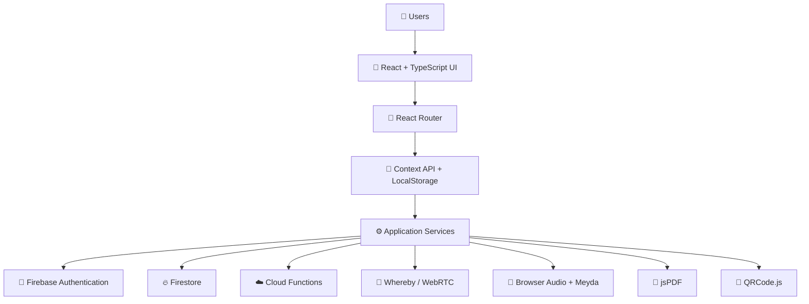

---

# 🔄 Application Data Flow

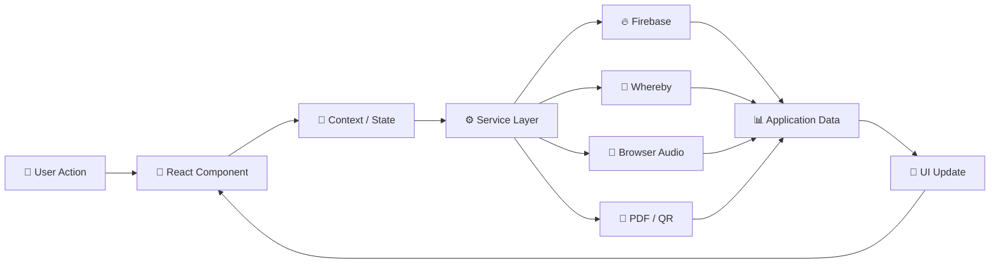

---

# 🧩 Project Structure

```text
CMC-5/
│
├── 📁 public/
│   └── Static assets
│
├── 📁 src/
│   │
│   ├── 📁 components/
│   │   ├── BrowserNavigation.tsx
│   │   ├── DoctorPatientChat.tsx
│   │   ├── PrescriptionWriter.tsx
│   │   └── ProfilePhotoUpload.tsx
│   │
│   ├── 📁 config/
│   │   └── firebase.ts
│   │
│   ├── 📁 contexts/
│   │   ├── AuthContext.tsx
│   │   ├── FirebaseAuthContext.tsx
│   │   └── LanguageContext.tsx
│   │
│   ├── 📁 pages/
│   │   ├── Homepage.tsx
│   │   ├── Chatbot.tsx
│   │   ├── SymptomChecker.tsx
│   │   ├── PatientDashboard.tsx
│   │   ├── DoctorDashboard.tsx
│   │   ├── DoctorDemoDashboard.tsx
│   │   ├── Appointments.tsx
│   │   ├── VideoConsultation.tsx
│   │   ├── PatientVideoConsultation.tsx
│   │   ├── AmbulanceDashboard.tsx
│   │   ├── VerifyPrescription.tsx
│   │   ├── Emergency.tsx
│   │   └── ...
│   │
│   ├── 📁 services/
│   │   ├── appointmentService.ts
│   │   ├── chatService.ts
│   │   ├── prescriptionService.ts
│   │   ├── pdfService.ts
│   │   ├── videoConsultationService.ts
│   │   ├── patientDataService.ts
│   │   ├── firebaseAppointmentService.ts
│   │   ├── firebaseDoctorReportService.ts
│   │   └── firebaseLabReportService.ts
│   │
│   ├── 📁 translations/
│   │   ├── en.json
│   │   ├── hi.json
│   │   ├── ta.json
│   │   ├── te.json
│   │   └── ...
│   │
│   ├── 📁 types/
│   │   └── index.ts
│   │
│   ├── 📁 utils/
│   │   ├── numberLocalization.ts
│   │   └── demoData.ts
│   │
│   ├── App.tsx
│   ├── main.tsx
│   └── index.css
│
├── 📄 .env.example
├── 📄 .gitignore
├── 📄 package.json
├── 📄 tsconfig.json
├── 📄 vite.config.ts
└── 📄 README.md
```

---

# 🔧 Configuration

## 🔥 Firebase Setup

1. Create a Firebase project.
2. Enable Authentication.
3. Configure Email/Password and Google authentication if required.
4. Create a Firestore database.
5. Add the Firebase configuration to `.env`.

### Environment Variables

```env
VITE_FIREBASE_API_KEY=your_api_key_here
VITE_FIREBASE_AUTH_DOMAIN=your_project_id.firebaseapp.com
VITE_FIREBASE_PROJECT_ID=your_project_id
VITE_FIREBASE_STORAGE_BUCKET=your_project_id.appspot.com
VITE_FIREBASE_MESSAGING_SENDER_ID=your_messaging_sender_id
VITE_FIREBASE_APP_ID=your_app_id

VITE_WHEREBY_API_KEY=your_whereby_api_key_here
```

> 🔐 Never commit real credentials or secret keys to GitHub.

---

# 🗄️ Firestore Data Model

The application uses Firestore collections such as:

```text
🔥 Firestore
│
├── 📅 appointments
├── 🩺 doctorReports
└── 🧪 labReports
```

---

# 💾 LocalStorage

The application also maintains selected client-side state using LocalStorage.

Examples:

```text
preferredLanguage
mediguide_users
mediguide_appointments
mediguide_appointments_{userId}
mediguide_patient_data_{userId}
mediguide_auto_reports_{userId}
mediguide_chats
mediguide_prescriptions
mediguide_video_rooms
mediguide_call_logs
```

---

# 📱 Screenshots

> Add screenshots to `docs/screenshots/` to showcase the application's interface.

### 🏠 Homepage


### 🤖 AI Chatbot


### 🔍 Symptom Checker


### 👨‍⚕️ Doctor Dashboard


### 👤 Patient Dashboard


---

# 🎥 Demo

<div align="center">

### 🚀 MediGuide AI in Action

**Video Demo:** Coming Soon

**Live Development Server:** `http://localhost:5173`

</div>

---

# 🧪 Test Accounts

| Role         | Email                     | Password        | Access                |
| ------------ | ------------------------- | --------------- | --------------------- |
| 👨‍⚕️ Doctor | `dr.rajesh@mediguide.com` | `doctor123`     | Full Doctor Dashboard |
| 👤 Patient   | `mariyam@email.com`       | `mariyam@123`   | Patient Portal        |
| 🚑 Ambulance | `ambulance@email.com`     | `ambulance@123` | Emergency Dashboard   |
| 🛡️ Admin    | `admin@email.com`         | `admin@123`     | Admin Panel           |

> ⚠️ These credentials are intended for development/demo purposes only. Never use demo credentials in production.

---

# 🚀 Getting Started

## 📋 Prerequisites

Before running MediGuide AI, install:

* 🟢 Node.js 18+
* 📦 npm or yarn
* 🔧 Git
* 🔥 Firebase account
* 🎥 Whereby account for video consultation functionality

---

## 1️⃣ Clone the Repository

```bash
git clone https://github.com/MariyamSeemab/Mediguide-CMC5.git
cd Mediguide-CMC5
```

---

## 2️⃣ Install Dependencies

```bash
npm install
```

Or:

```bash
yarn install
```

---

## 3️⃣ Configure Environment Variables

```bash
cp .env.example .env
```

Update `.env` with the required Firebase and Whereby configuration.

---

## 4️⃣ Start Development Server

```bash
npm run dev
```

Or:

```bash
yarn dev
```

---

## 5️⃣ Open the Application

```text
http://localhost:5173
```

---

# 📦 Production Build

Create an optimized production build:

```bash
npm run build
```

Preview the production build locally:

```bash
npm run preview
```

The generated production files will be available in:

```text
dist/
```

---

# 🧪 Testing

## Run Tests

```bash
npm test
```

## Watch Mode

```bash
npm run test:watch
```

## Coverage

```bash
npm run test:coverage
```

## Code Quality

```bash
npm run lint
```

Automatically fix lint issues:

```bash
npm run lint:fix
```

### 🧪 Testing Stack

* Jest
* React Testing Library
* TypeScript
* ESLint
* Prettier

---

# 🎥 Testing Video Consultation

To test the doctor-patient video experience:

1. Open two browser sessions.
2. Login as the doctor in one.
3. Login as the patient in the second.
4. Create/confirm an appointment.
5. Doctor starts the consultation.
6. Patient joins from the appointment interface.
7. Test:

   * 🎥 Video
   * 🎙️ Audio
   * 💬 Chat
   * 🖥️ Screen sharing
   * ⏱️ Call duration

---

# 🎨 UI/UX Philosophy

MediGuide AI follows a healthcare-focused design approach.

### 🎯 User First

Simple navigation and clear actions for patients, doctors and emergency users.

### 📱 Responsive

Designed to work across:

* 💻 Desktop
* 💻 Laptop
* 📱 Mobile
* 📲 Tablet

### ♿ Accessibility

The interface aims to provide an inclusive experience with readable content, clear navigation and accessible interactions.

### ⚡ Performance

Vite provides fast development feedback and optimized production builds.

### 🎨 Visual Identity

The interface uses a healthcare-oriented visual language:

```text
🔵 Medical Blue      → Trust & Healthcare
🔷 Trust Blue        → Professional UI
🟢 Health Green      → Success & Positive Results
🟠 Alert Orange      → Warnings
🔴 Emergency Red     → Critical Situations
```

---

# 🔐 Security

MediGuide AI includes several application-level security mechanisms.

### 🔑 Authentication

* Firebase Authentication
* Secure login/signup
* Protected application routes

### 👥 Authorization

Role-based experiences for:

* 👤 Patient
* 👨‍⚕️ Doctor
* 🛡️ Admin
* 🚑 Ambulance

### 🔒 Data Protection

* Firebase-managed authentication
* Protected application resources
* Appointment-based video access
* Prescription verification
* Environment-based configuration

### 🛡️ Security Principles

```text
User
  ↓
🔐 Authenticate
  ↓
👥 Determine Role
  ↓
🛡️ Authorize
  ↓
📦 Access Allowed Resources
```

For security-related issues, refer to `SECURITY.md`.

---

# 📊 Project Highlights

<div align="center">

<table>
<tr>
<td align="center">

### 🌍

## 13

Indian Languages

</td>

<td align="center">

### 🤖

## 46+

Medical Categories

</td>

<td align="center">

### 🎤

## AI

Voice Analysis

</td>

<td align="center">

### 🎥

## Real-Time

Video Consultation

</td>
</tr>
</table>

</div>

---

# 🗺️ Roadmap

## ✅ Version 1.0.0

* [x] 🤖 AI chatbot
* [x] 🔍 Symptom checker
* [x] 🎤 Voice emotion detection
* [x] 🎵 Audio feature extraction
* [x] 🌍 13-language support
* [x] 🔎 Medical keyword detection
* [x] 🚨 Urgency classification
* [x] 📅 Doctor appointment booking
* [x] 📊 Health report generation
* [x] 🚑 Emergency services

## ✅ Version 1.5.0

* [x] 🎥 Real-time video consultations
* [x] 💊 Digital prescriptions
* [x] 📄 PDF generation
* [x] 🔳 QR prescription verification
* [x] 💬 Doctor-patient chat
* [x] 📅 Appointment synchronization
* [x] 👨‍⚕️ Doctor dashboard
* [x] 📊 Analytics
* [x] 🚑 Ambulance response system
* [x] 💳 Enhanced UPI payment experience
* [x] 📱 Patient video consultation

## 🚧 Version 2.0.0

* [ ] 🧠 Advanced AI model integration
* [ ] 💳 Payment gateway integration
* [ ] 📧 Email notifications
* [ ] 📱 SMS notifications
* [ ] 📊 Advanced analytics dashboard

## 🔮 Version 2.5.0

* [ ] 📱 React Native mobile application
* [ ] 💊 Pharmacy integration
* [ ] 🏦 Health insurance integration
* [ ] ⌚ Wearable device integration
* [ ] 🔐 Multi-factor authentication
* [ ] 🛡️ Additional healthcare compliance capabilities

---

# 🌐 Browser Support

| Browser          | Support     |
| ---------------- | ----------- |
| 🌐 Chrome        | ✅ Supported |
| 🦊 Firefox       | ✅ Supported |
| 🧭 Safari        | ✅ Supported |
| 🌊 Edge          | ✅ Supported |
| 🎭 Opera         | ✅ Supported |
| 📱 Mobile Safari | ✅ Supported |
| 📱 Chrome Mobile | ✅ Supported |

---

# 📁 Development Workflow

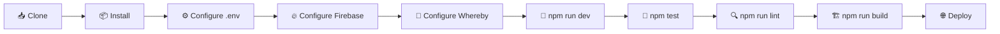

---

# 📦 Deployment

## 🔥 Firebase Hosting

```bash
npm install -g firebase-tools

firebase login

firebase init hosting

npm run build

firebase deploy
```

## ⚡ Vercel

MediGuide AI can also be deployed using Vercel after connecting the GitHub repository.

## 🌐 Netlify

The production `dist` folder can also be deployed through Netlify.

For detailed deployment instructions, refer to:

```text
DEPLOYMENT_GUIDE.md
```

---

# 🤝 Contributing

Contributions are welcome! 💙

## 💡 Ways You Can Contribute

* 🐛 Report bugs
* 💡 Suggest features
* 📝 Improve documentation
* 🌍 Add language translations
* 🎨 Improve UI/UX
* 🧪 Add tests
* ⚡ Improve performance
* 🔐 Improve security
* 📢 Share the project

## 🔧 Contribution Workflow

```bash
# Fork the repository

# Create a feature branch
git checkout -b feature/AmazingFeature

# Make your changes

# Commit
git commit -m "Add AmazingFeature"

# Push
git push origin feature/AmazingFeature

# Open a Pull Request
```

---

# 📄 License

This project is licensed under the **MIT License**.

See the [`LICENSE`](LICENSE) file for details.

```text
MIT License
Copyright (c) 2024 MediGuide AI Team
```

---

# 👥 Team

<div align="center">

### Project Maintainers

<table>
  <tr>
    <td align="center">
      <br />
      <sub><b>Mahek Mukadam</b></sub><br />
      <a href="https://github.com/M-Mahek-03">GitHub</a>
    </td>

```
<td align="center">
  <br />
  <sub><b>Mariyam Usmani</b></sub><br />
  <a href="https://github.com/MariyamSeemab">GitHub</a>
</td>

<td align="center">
  <br />
  <sub><b>Nadeem Shaikh</b></sub><br />
  <a href="https://github.com/nadeem221751">GitHub</a>
</td>

<td align="center">
  <br />
  <sub><b>Nehal Shaikh</b></sub><br />
  <a href="https://github.com/Electrogreek">GitHub</a>
</td>
```

  </tr>
</table>

**Together, we're building the future of accessible healthcare in India! 🇮🇳**

</div>

---

# 🙏 Acknowledgments

Special thanks to the technologies and communities that helped make MediGuide AI possible:

* 💙 Open Source Community
* 🔥 Firebase Team
* ⚛️ React Team
* ⚡ Vite Team
* 🎥 Whereby Team
* 📄 jsPDF Team
* 🏥 Healthcare Professionals
* 🇮🇳 Indian Developer Community
* 👥 All Contributors

---

# 📞 Help & Support

Need help with MediGuide AI?

### 🐛 Report a Bug

Open an issue in the repository with:

* What happened?
* Steps to reproduce
* Expected behavior
* Actual behavior
* Screenshots/logs if available

### 💡 Request a Feature

Have an idea that could improve MediGuide AI?

Open a feature request and describe:

* 💡 Proposed feature
* 🎯 Problem it solves
* 👥 Who would benefit
* 🔧 Suggested implementation

### 💬 Questions & Discussion

Start a GitHub Discussion for questions, ideas and general project discussions.

### 👩‍💻 Project Contact

**GitHub:** `@MariyamSeemab`

---

# ⭐ Support MediGuide AI

If you find this project useful:

⭐ **Star the repository**

🍴 **Fork the project**

🐛 **Report issues**

💡 **Suggest improvements**

🌍 **Help improve multilingual healthcare accessibility**

---

# 📈 Project Vision

MediGuide AI is built around one simple idea:

<div align="center">

## 🏥 Healthcare should be accessible, understandable and inclusive.

### 🌍 Any language

### 🤖 Any time

### 📱 Any device

### 👨‍⚕️ Connect with professionals

### 🚑 Get help when it matters

</div>

---

# ⚠️ Medical Disclaimer

**MediGuide AI is a technology demonstration and healthcare-assistance platform.**

Information generated or displayed by the application should **not** be treated as a medical diagnosis, prescription or substitute for professional medical advice.

For serious, emergency or life-threatening symptoms, users should contact qualified healthcare professionals or appropriate emergency services immediately.

---

<div align="center">

# 💙 Made for Better Healthcare Accessibility

### 🏥 MediGuide AI

**AI • Healthcare • Voice • Languages • Doctors • Emergency Care**

<br/>


<br/><br/>

### ⭐ If you like MediGuide AI, give the repository a star!

**Every star motivates us to keep building. 💙**

<br/>

[⬆️ Back to Top](#-mediguide-ai)

</div>
