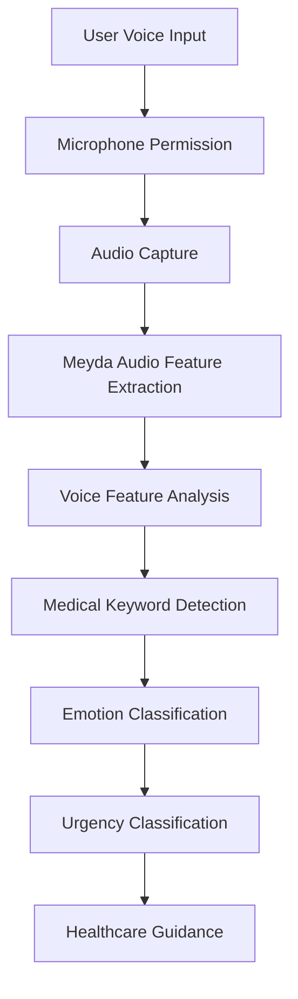
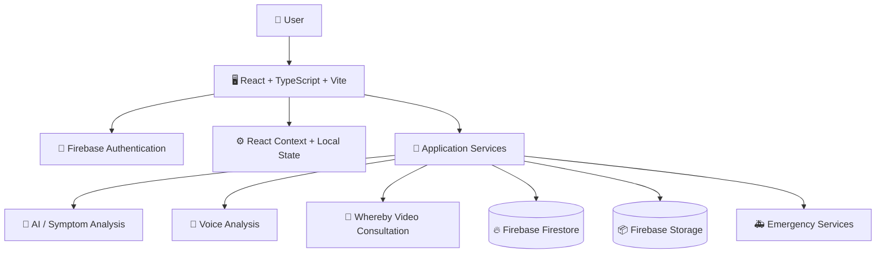
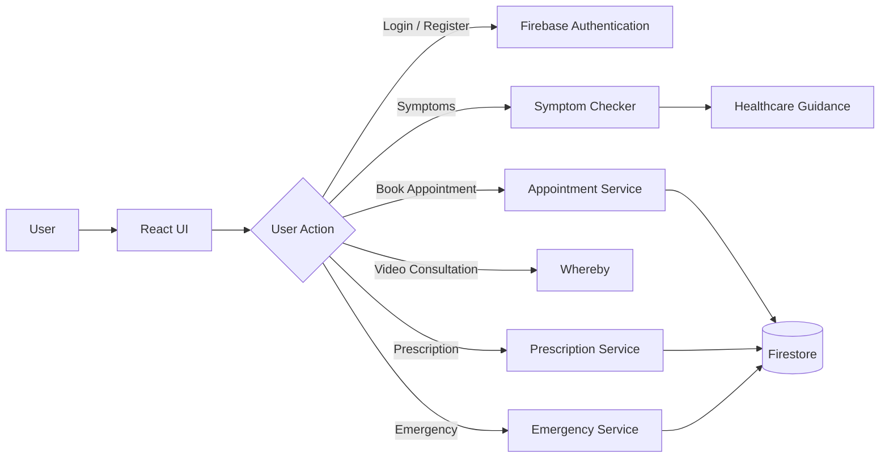
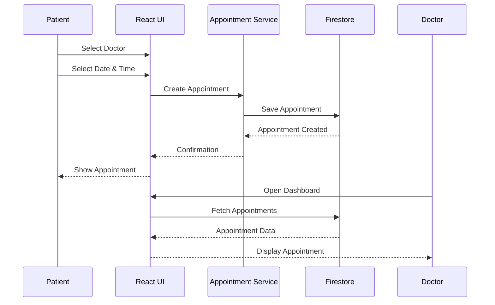
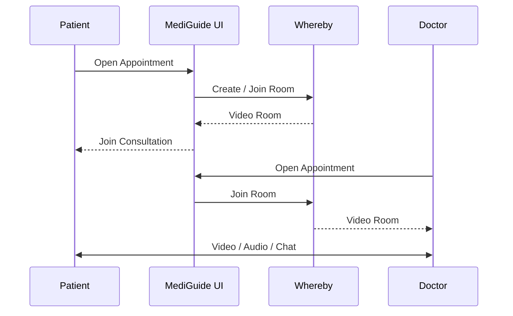

<div align="center">


# 🏥 MediGuide AI

### Your Intelligent Healthcare Companion

<p>
  <strong>AI-powered healthcare guidance with multilingual support, doctor consultations, digital prescriptions, and emergency services.</strong>
</p>

<p>
  <a href="#-features">✨ Features</a> •
  <a href="#-getting-started">🚀 Quick Start</a> •
  <a href="#-architecture">📊 Architecture</a> •
  <a href="#-team">👥 Team</a> •
  <a href="#-contributing">🤝 Contributing</a>
</p>

<p>
  
  
  
  
  
</p>

<p>
  
  
</p>

</div>

---

## 📋 Table of Contents

* [🌟 Why MediGuide AI?](#-why-mediguide-ai)
* [✨ Features](#-features)
* [🎯 Key Highlights](#-key-highlights)
* [🛠️ Tech Stack](#️-tech-stack)
* [🚀 Getting Started](#-getting-started)
* [📱 Screenshots](#-screenshots)
* [🌍 Language Support](#-language-support)
* [🏗️ Project Structure](#️-project-structure)
* [🔧 Configuration](#-configuration)
* [🎤 Voice Emotion Detection](#-voice-emotion-detection)
* [📊 Architecture](#-architecture)
* [🎨 UI/UX Design](#-uiux-design)
* [🧪 Testing](#-testing)
* [📦 Deployment](#-deployment)
* [🔒 Security](#-security)
* [📈 Roadmap](#-roadmap)
* [🤝 Contributing](#-contributing)
* [📄 License](#-license)
* [👥 Team](#-team)
* [🙏 Acknowledgments](#-acknowledgments)
* [📞 Support](#-support)

---

# 🌟 Why MediGuide AI?

Healthcare accessibility can be challenging because of geographical limitations, language barriers, long waiting times, and limited access to immediate medical guidance.

**MediGuide AI** aims to provide a centralized digital healthcare experience through AI-powered assistance, multilingual support, doctor consultations, digital prescriptions, and emergency services.

### 🎯 The Challenge

| Challenge            | Description                                                               |
| -------------------- | ------------------------------------------------------------------------- |
| 🏥 Limited Access    | Many people have limited access to immediate healthcare guidance.         |
| 🌍 Language Barriers | Healthcare information may not always be available in regional languages. |
| ⏱️ Long Wait Times   | Patients may have to wait for basic consultations or information.         |

### 💡 Our Solution

MediGuide AI provides:

* 🤖 AI-powered healthcare guidance
* 🌍 Support for 13 Indian languages
* 🔍 Symptom checking
* 🎤 Voice-based input and analysis
* 📸 Image-based symptom input
* 👨‍⚕️ Doctor consultations
* 🎥 Real-time video consultations
* 💊 Digital prescriptions
* 🔐 QR-based prescription verification
* 🚑 Emergency ambulance services
* 💬 Doctor-patient communication
* 💳 Online payment support

> **"Making quality healthcare more accessible to people across India, in their own language."**

---

# ✨ Features

## 🤖 AI-Powered Medical Chatbot

* 🧠 Natural-language conversations
* 🌍 Multilingual healthcare interaction
* 🏥 Medical category-based guidance
* 💭 Conversation context
* 🚨 Emergency symptom detection
* 📊 Health-related insights

---

## 🔍 Advanced Symptom Checker

### Input Methods

* ⌨️ Text-based symptom description
* 🎤 Voice input
* 📸 Image upload
* 🎵 Voice analysis

### Analysis

* 🎯 Urgency classification
* 🎭 Emotion classification
* 📊 Voice-quality analysis
* 🔍 Medical keyword detection
* ⚡ Fast AI-assisted health insights

---

## 🎥 Video Consultation System

* 📹 Video consultations using Whereby
* 🔒 Appointment-based access
* ⏱️ Call duration tracking
* 💬 In-call messaging
* 📱 Responsive interface
* 📊 Consultation history

---

## 💊 Digital Prescription System

* 📝 Digital prescription creation
* 📄 PDF generation
* 🔐 QR-code verification
* 🆔 Unique prescription IDs
* ✍️ Doctor authentication
* 🔍 Prescription verification

Example prescription ID:

```text
RX-YYYY-NNNNNN
```

---

## 🚑 Emergency Ambulance System

* 📍 Location-based ambulance tracking
* 🗺️ Route assistance
* ⚡ Emergency booking
* 📊 Ambulance mission dashboard
* 🔔 Emergency notifications
* 💰 Mission tracking

---

## 👨‍⚕️ Doctor Dashboard

* 📅 Appointment management
* 💬 Patient communication
* 📝 Prescription management
* 📊 Patient analytics
* 🎥 Video consultation
* 📱 Doctor profile management

---

## 💳 Payment Support

* 📱 UPI payment support
* 💳 Consultation fee tracking
* ✅ Payment verification
* 📊 Payment history

---

## 🌍 Multilingual Support

* 🔄 Language switching
* 🎤 Voice input
* 📝 Native scripts
* 🌐 Localized healthcare content

---

# 🎯 Key Highlights

| Feature            | Description                                        |
| ------------------ | -------------------------------------------------- |
| 🌍 Multilingual    | 13 Indian languages                                |
| 🤖 AI-Powered      | AI-assisted healthcare guidance                    |
| 🎤 Voice Analysis  | Voice feature and emotion analysis                 |
| 🔍 Symptom Checker | Text, voice, and image-based inputs                |
| 🎥 Video Calls     | Real-time doctor consultations                     |
| 💊 Digital Rx      | Digital prescriptions with PDF and QR verification |
| 💬 Real-time Chat  | Doctor-patient communication                       |
| 🔒 Authentication  | Firebase authentication                            |
| 📱 Responsive      | Desktop, tablet, and mobile support                |
| ⚡ Fast             | Vite-powered frontend                              |
| 🎨 Modern UI       | Responsive and interactive interface               |
| 📊 Analytics       | Healthcare and consultation insights               |

---

# 🛠️ Tech Stack

## Frontend

| Technology              | Purpose                 |
| ----------------------- | ----------------------- |
| React 18.3.1            | UI development          |
| TypeScript 5.6.3        | Type safety             |
| Vite 6.0.1              | Frontend tooling        |
| React Router DOM 6.28.0 | Client-side routing     |
| CSS Modules             | Component-level styling |

## Backend & Database

| Technology              | Purpose              |
| ----------------------- | -------------------- |
| Firebase                | Backend-as-a-Service |
| Firebase Authentication | User authentication  |
| Firestore               | NoSQL database       |
| Cloud Functions         | Serverless backend   |
| Firebase Hosting        | Application hosting  |

## Video & Communication

| Technology  | Purpose                 |
| ----------- | ----------------------- |
| Whereby API | Video consultations     |
| WebRTC      | Real-time communication |

## Documents & Verification

| Technology | Purpose                     |
| ---------- | --------------------------- |
| jsPDF      | Prescription PDF generation |
| QRCode.js  | QR-code generation          |

## Audio & Voice

| Technology       | Purpose                  |
| ---------------- | ------------------------ |
| Web Speech API   | Speech recognition       |
| Meyda            | Audio feature extraction |
| File API         | Image/file processing    |
| LocalStorage API | Client-side persistence  |

## Development Tools

* ESLint
* Prettier
* Jest
* React Testing Library
* TypeScript

---

# 🚀 Getting Started

## Prerequisites

Before running MediGuide AI locally, install:

* Node.js v18 or higher
* npm or Yarn
* Git
* Firebase account
* Whereby account for video consultation functionality

---

## 1. Clone the Repository

```bash
git clone https://github.com/M-Mahek-03/CMC-5.git
cd CMC-5
```

---

## 2. Install Dependencies

```bash
npm install
```

Or:

```bash
yarn install
```

---

## 3. Configure Environment Variables

Create your environment file:

```bash
cp .env.example .env
```

Add the required Firebase and Whereby configuration:

```env
VITE_FIREBASE_API_KEY=your_api_key_here
VITE_FIREBASE_AUTH_DOMAIN=your_project_id.firebaseapp.com
VITE_FIREBASE_PROJECT_ID=your_project_id
VITE_FIREBASE_STORAGE_BUCKET=your_storage_bucket
VITE_FIREBASE_MESSAGING_SENDER_ID=your_messaging_sender_id
VITE_FIREBASE_APP_ID=your_app_id

VITE_WHEREBY_API_KEY=your_whereby_api_key
```

> ⚠️ **Never commit real API keys or private credentials to GitHub.**

---

## 4. Start the Development Server

```bash
npm run dev
```

Or:

```bash
yarn dev
```

Open the application:

```text
http://localhost:5173
```

---

## 5. Build for Production

```bash
npm run build
```

The production build will be generated in:

```text
dist/
```

---

## 6. Preview the Production Build

```bash
npm run preview
```

---

# 📱 Screenshots

Store screenshots inside:

```text
docs/screenshots/
```

Recommended structure:

```text
docs/
└── screenshots/
    ├── homepage.png
    ├── chatbot.png
    ├── symptom-checker.png
    ├── doctor-dashboard.png
    └── patient-dashboard.png
```

## 🏠 Homepage


## 💬 AI Chatbot


## 🔍 Symptom Checker


## 👨‍⚕️ Doctor Dashboard


## 📊 Patient Dashboard


> If a screenshot is not available in the repository, remove its image reference until the file is added.

---

# 🌍 Language Support

MediGuide AI supports the following 13 languages:

| Language  | Native Name | Code | Status     |
| --------- | ----------- | ---- | ---------- |
| English   | English     | `en` | ✅ Complete |
| Hindi     | हिंदी       | `hi` | ✅ Complete |
| Tamil     | தமிழ்       | `ta` | ✅ Complete |
| Telugu    | తెలుగు      | `te` | ✅ Complete |
| Bengali   | বাংলা       | `bn` | ✅ Complete |
| Marathi   | मराठी       | `mr` | ✅ Complete |
| Gujarati  | ગુજરાતી     | `gu` | ✅ Complete |
| Kannada   | ಕನ್ನಡ       | `kn` | ✅ Complete |
| Malayalam | മലയാളം      | `ml` | ✅ Complete |
| Punjabi   | ਪੰਜਾਬੀ      | `pa` | ✅ Complete |
| Odia      | ଓଡ଼ିଆ       | `or` | ✅ Complete |
| Assamese  | অসমীয়া     | `as` | ✅ Complete |
| Urdu      | اردو        | `ur` | ✅ Complete |

---

# 🏗️ Project Structure

```text
CMC-5/
│
├── public/
│   └── Static assets
│
├── src/
│   │
│   ├── components/
│   │   ├── BrowserNavigation.tsx
│   │   ├── DoctorPatientChat.tsx
│   │   ├── PrescriptionWriter.tsx
│   │   └── ProfilePhotoUpload.tsx
│   │
│   ├── config/
│   │   └── firebase.ts
│   │
│   ├── contexts/
│   │   ├── AuthContext.tsx
│   │   ├── FirebaseAuthContext.tsx
│   │   └── LanguageContext.tsx
│   │
│   ├── pages/
│   │   ├── Homepage.tsx
│   │   ├── Chatbot.tsx
│   │   ├── SymptomChecker.tsx
│   │   ├── PatientDashboard.tsx
│   │   ├── DoctorDashboard.tsx
│   │   ├── DoctorDemoDashboard.tsx
│   │   ├── Appointments.tsx
│   │   ├── VideoConsultation.tsx
│   │   ├── PatientVideoConsultation.tsx
│   │   ├── AmbulanceDashboard.tsx
│   │   ├── VerifyPrescription.tsx
│   │   ├── Emergency.tsx
│   │   └── ...
│   │
│   ├── services/
│   │   ├── appointmentService.ts
│   │   ├── chatService.ts
│   │   ├── prescriptionService.ts
│   │   ├── pdfService.ts
│   │   ├── videoConsultationService.ts
│   │   ├── patientDataService.ts
│   │   ├── firebaseAppointmentService.ts
│   │   ├── firebaseDoctorReportService.ts
│   │   └── firebaseLabReportService.ts
│   │
│   ├── translations/
│   │   ├── en.json
│   │   ├── hi.json
│   │   ├── ta.json
│   │   └── ...
│   │
│   ├── types/
│   │   └── index.ts
│   │
│   ├── utils/
│   │   ├── numberLocalization.ts
│   │   └── demoData.ts
│   │
│   ├── App.tsx
│   ├── main.tsx
│   └── index.css
│
├── .env.example
├── .gitignore
├── package.json
├── tsconfig.json
├── vite.config.ts
└── README.md
```

---

# 🔧 Configuration

## Firebase Setup

Create a Firebase project and configure:

1. Firebase Authentication
2. Email/Password authentication
3. Google authentication if required
4. Firestore
5. Firebase Storage if required
6. Firebase Hosting if deploying through Firebase

Add the Firebase configuration to `.env`.

---

## Whereby Setup

For video consultations:

1. Create a Whereby account.
2. Configure the required API credentials.
3. Add the credentials to `.env`.
4. Start the application.

---

## Firestore Collections

The application uses collections such as:

```text
appointments
doctorReports
labReports
```

---

## LocalStorage

The application may use LocalStorage for client-side data such as:

```text
preferredLanguage
mediguide_users
mediguide_appointments
mediguide_appointments_{userId}
mediguide_patient_data_{userId}
mediguide_auto_reports_{userId}
mediguide_chats
mediguide_prescriptions
mediguide_video_rooms
mediguide_call_logs
```

> ⚠️ LocalStorage should not be treated as a secure database for sensitive medical information.

---

# 🎤 Voice Emotion Detection

MediGuide AI includes browser-based voice analysis designed to identify voice patterns that may indicate distress or urgency.

## How It Works



## Audio Features

The application can analyze features such as:

* Volume / RMS
* Zero-crossing rate
* Energy
* Peak analysis
* Variance
* Dynamic range
* Speech rate
* Spectral flux

## Medical Keyword Categories

Medical keywords can be grouped into:

* 🚨 Critical symptoms
* ⚠️ Severity indicators
* 🩹 Pain indicators
* 😟 Anxiety indicators
* 😴 Weakness and fatigue indicators

## Emotion Classification

| Emotion    | Possible Indicators                            | Urgency     |
| ---------- | ---------------------------------------------- | ----------- |
| Critical   | Critical keywords + strong distress indicators | 🔴 Critical |
| In Pain    | Pain indicators + voice strain                 | 🟠 High     |
| Distressed | Unstable voice + fast speech                   | 🟠 High     |
| Anxious    | Fast speech + anxiety indicators               | 🟡 Medium   |
| Weak/Tired | Low volume + fatigue indicators                | 🟡 Medium   |
| Calm       | Stable voice characteristics                   | 🟢 Low      |

## Voice Quality Analysis

The system can provide indicators such as:

* ✅ Normal voice patterns
* ⚠️ Elevated voice level
* ⚠️ Signs of distress
* ⚠️ Voice strain
* ⚠️ Elevated pitch
* ⚠️ Low voice volume
* ⚠️ Possible fatigue
* 🚨 Possible urgent condition

> **Important:** Voice analysis is a supportive feature and should not be treated as a medical diagnosis.

## Privacy

Where the implementation supports client-side processing:

* 🎤 Microphone access requires user permission.
* 🔒 Audio should not be stored unnecessarily.
* 💻 Processing can be performed in the browser.
* 🔐 Sensitive healthcare data should be handled securely.

---

# 📊 Architecture

## System Architecture



---

## Application Flow



---

## Appointment Flow



---

## Video Consultation Flow



---

# 🎨 UI/UX Design

## Design Principles

* 👤 **User First** — Simple and intuitive interface
* ♿ **Accessibility** — Designed with accessibility in mind
* 📱 **Responsive** — Desktop, tablet, and mobile support
* ⚡ **Performance** — Fast development and production builds
* 🎨 **Consistency** — Consistent healthcare-oriented visual language

## Color Palette

```css
Primary:   #00D9FF
Secondary: #4A90E2
Success:   #50C878
Warning:   #FFB84D
Error:     #FF6B6B
```

## Typography

```text
Headings: Inter / System UI
Body:     System UI
Code:     Fira Code / Consolas / Monaco
```

---

# 🧪 Testing

## Run Tests

```bash
npm test
```

Watch mode:

```bash
npm run test:watch
```

Coverage:

```bash
npm run test:coverage
```

## Testing Stack

| Tool                  | Purpose            |
| --------------------- | ------------------ |
| Jest                  | Unit testing       |
| React Testing Library | Component testing  |
| TypeScript            | Type checking      |
| ESLint                | Code quality       |
| Prettier              | Code formatting    |
| Cypress               | End-to-end testing |

> Update coverage percentages in this README only when they are generated from the current codebase.

## Video Consultation Testing

To test video consultations:

1. Open the application in two browser sessions.
2. Log in as a doctor in one session.
3. Log in as a patient in the other.
4. Create or open an appointment.
5. Start the consultation from the doctor dashboard.
6. Join the consultation as the patient.
7. Test video, audio, chat, and other enabled features.

---

# 📦 Deployment

## Firebase Hosting

```bash
npm install -g firebase-tools

firebase login

firebase init hosting

npm run build

firebase deploy
```

## Vercel

The application can also be deployed using Vercel after configuring the required environment variables.

## Netlify

The production `dist` folder can be deployed to Netlify.

> Make sure all required environment variables are configured in the deployment platform before deploying.

---

# 🔒 Security

Security considerations include:

* 🔐 Firebase Authentication
* 👥 Role-based access
* 🛡️ Protected routes
* 🔑 Environment-based configuration
* 📄 Prescription verification
* 🎥 Appointment-based video access
* 🚫 Avoiding hard-coded secrets

## Security Recommendations

Never commit:

```text
.env
API keys
private credentials
service-account JSON files
database credentials
```

Use environment variables for sensitive configuration.

---

# 📈 Roadmap

## ✅ Completed

* [x] AI healthcare chatbot
* [x] Symptom checker
* [x] Text-based symptom input
* [x] Voice input
* [x] Image-based input
* [x] Voice analysis
* [x] Medical keyword detection
* [x] Urgency classification
* [x] 13 Indian languages
* [x] Doctor consultation booking
* [x] Health reports
* [x] Emergency services

## ✅ Additional Features

* [x] Video consultations
* [x] Digital prescriptions
* [x] Prescription PDF generation
* [x] QR-code verification
* [x] Doctor-patient chat
* [x] Appointment synchronization
* [x] Doctor dashboard
* [x] Patient video consultation
* [x] Ambulance dashboard
* [x] UPI payment support

## 🚧 Planned

* [ ] Advanced AI integration
* [ ] Payment gateway integration
* [ ] SMS notifications
* [ ] Email notifications
* [ ] Advanced analytics
* [ ] Mobile application
* [ ] Pharmacy integration
* [ ] Health insurance integration
* [ ] Wearable-device integration
* [ ] Multi-factor authentication

---

# 🤝 Contributing

Contributions are welcome.

## Ways to Contribute

* 🐛 Report bugs
* 💡 Suggest features
* 📝 Improve documentation
* 🌍 Add translations
* 🎨 Improve UI/UX
* 🧪 Add tests
* ⚡ Improve performance

## Contribution Workflow

```bash
# Fork the repository

# Clone your fork
git clone https://github.com/M-Mahek-03/CMC-5.git

# Move into the project
cd CMC-5

# Create a feature branch
git checkout -b feature/AmazingFeature

# Make your changes

# Commit your changes
git add .
git commit -m "Add AmazingFeature"

# Push your branch
git push origin feature/AmazingFeature
```

Then open a Pull Request.

## Contributors

<a href="https://github.com/M-Mahek-03/CMC-5/graphs/contributors">
  
</a>

---

# 📄 License

This project is licensed under the **MIT License**.

See the [LICENSE](LICENSE) file for details.

---

# 👥 Team

<div align="center">

### Project Maintainers

<table>
  <tr>
    <td align="center">
      <a href="https://github.com/M-Mahek-03">
        
        <br />
        <sub><b>Mahek Mukadam</b></sub>
      </a>
      <br />
      GitHub
    </td>

```
<td align="center">
  <a href="https://github.com/MariyamSeemab">
    
    <br />
    <sub><b>Mariyam Usmani</b></sub>
  </a>
  <br />
  GitHub
</td>

<td align="center">
  <a href="https://github.com/nadeem221751">
    
    <br />
    <sub><b>Nadeem Shaikh</b></sub>
  </a>
  <br />
  GitHub
</td>

<td align="center">
  <a href="https://github.com/Electrogreek">
    
    <br />
    <sub><b>Nehal Shaikh</b></sub>
  </a>
  <br />
  GitHub
</td>
```

  </tr>
</table>

**Together, we're building the future of accessible healthcare in India! 🇮🇳**

</div>

---

# 🙏 Acknowledgments

Special thanks to:

* 💙 Open Source Community
* 🔥 Firebase Team
* ⚛️ React Team
* ⚡ Vite Team
* 🎥 Whereby Team
* 📄 jsPDF Team
* 🎤 Meyda Audio Library
* 🏥 Healthcare professionals
* 🇮🇳 Indian developer community
* 👥 All project contributors

---

# 📞 Support

If you have questions or encounter an issue:

* 🐛 Open a GitHub Issue
* 💡 Submit a feature request
* 💬 Start a discussion
* 📧 Contact: `mnmukadam04@gmail.com`

---

# 🌟 Support the Project

If you find MediGuide AI useful:

* ⭐ Star the repository
* 🍴 Fork the repository
* 🐛 Report bugs
* 💡 Suggest improvements
* 🤝 Contribute to the project

---

<div align="center">

## 🇮🇳 Made with ❤️ for Better Healthcare Accessibility in India

**MediGuide AI**

Built with React • TypeScript • Firebase • Vite • Whereby

⭐ **If you like this project, consider giving it a star!** ⭐

</div>
